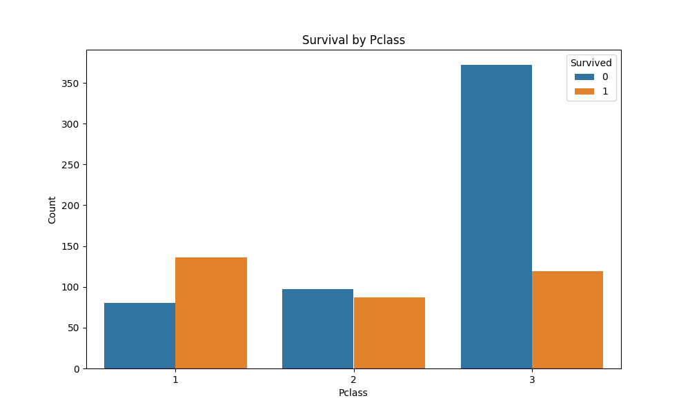

# Titanic Survival Analysis

## Описание проекта

Этот проект направлен на анализ данных пассажиров Titanic для предсказания выживаемости. Мы используем различные методы предобработки данных и модели машинного обучения для создания прогностической модели, которая может классифицировать, выживет ли пассажир или нет.

## Структура проекта

- `src/`: Исходный код проекта, включая предобработку данных и моделирование.
- `tests/`: Модульные тесты для проверки функциональности предобработки и моделирования.
- `reports/`: Итоговые отчеты и визуализации результатов.
- `data/`: Исходные данные и любые дополнительные файлы.

## Основные результаты

### AUC: 0.88

- **AUC** (Area Under the Curve) - это метрика, показывающая способность модели различать между выжившими и невыжившими пассажирами. Значение 0.88 указывает на то, что модель имеет высокую способность к правильной классификации.

## Визуализации

### age_distribution.png

- **Описание**: График распределения возрастов пассажиров. Помогает понять, как возраст влияет на выживаемость.

### correlation_matrix.png

- **Описание**: Матрица корреляции между различными признаками. Используется для анализа взаимосвязей между признаками и их влияния на выживаемость.

### roc_curve.png

- **Описание**: ROC-кривая модели. Площадь под кривой (AUC) равна 0.88, что демонстрирует высокую эффективность модели.

### survival_by_class.png

- **Описание**: График выживаемости по классам. Показывает распределение выживаемости пассажиров по классам.

### survival_by_sex.png

- **Описание**: График выживаемости по полу. Позволяет увидеть разницу в выживаемости между мужчинами и женщинами.

## Предобработка данных

Включает следующие шаги:
1. **Заполнение пропущенных значений**: 
   - Среднее значение для `Age`.
   - Модальное значение для `Embarked`.
2. **Кодирование категориальных переменных**: 
   - Преобразование `Sex` в числовой формат.

## Моделирование

- **Модель**: Логистическая регрессия.
- **Оценка модели**: Использование метрики AUC для оценки качества модели.

